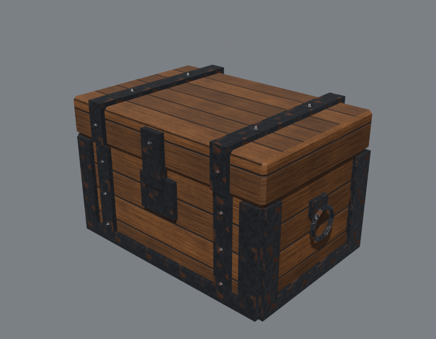
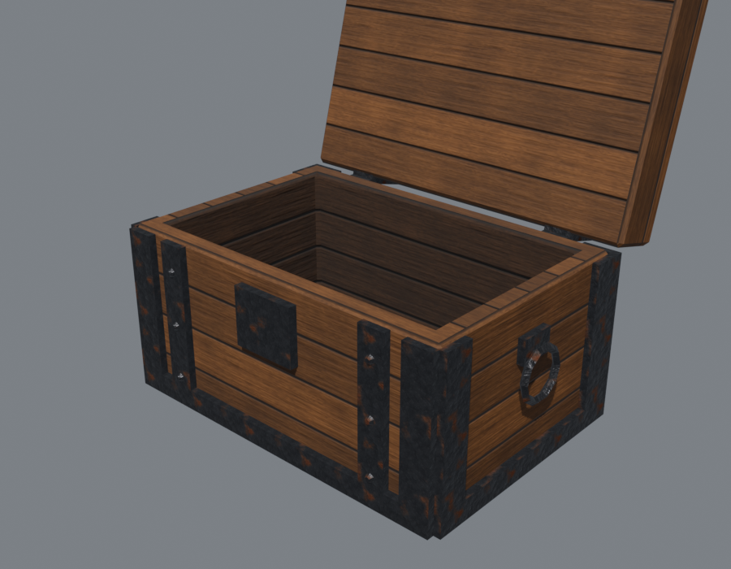

# JMI 3D Toolkit for Foundry VTT

A Foundry VTT (v13–v14) module for games that use the [3D Canvas](https://foundryvtt.com/packages/levels-3d-preview) module. It also contains the Blender sources for every model it ships. Built and tested with the D&D 5e system 5.3.

| Closed | Opened |
|---|---|
|  |  |

## Install
In Foundry: **Add-on Modules → Install Module**, paste this manifest URL, then **Install**:

```
https://github.com/JustMoreInnovation/foundry-vtt-modules/releases/latest/download/module.json
```

Enable **JMI 3D Toolkit** in your world, along with its required modules: **3D Canvas** (`levels-3d-preview`) and **socketlib**. Foundry offers updates automatically whenever a new release is published.

> Replaces the earlier standalone modules `loot-3d`, `chest-loot-3d`, `scenario-checkpoints` and `door-keys-3d`. Disable those first. On the GM's first load, the toolkit migrates their data (lootable tiles, contents actors, checkpoints) and repoints tiles that used the bundled models.

## Features
- **Lootables.** Any 3D tile can become a lootable container: a chest, a bone pile, a barrel.
  - Players click it (Token layer, token selected, within 3 squares) and get a loot window with **Take** and **Take all**.
  - Contents come from a linked *contents actor*, so only what you put there can be looted.
  - Optional: a lock and key item, a lid animation (any GLB with an opening clip), and removing the tile once it's empty.
  - All transfers run on the GM client.
- **Scenario checkpoints.** Save the current scene (tokens, tiles, chest states), its monsters, loot actors and pinned journals as an Adventure in a world compendium. Load it later to reset or replay. Player characters are optional.
- **Door keys.** A locked 3D *model door* with a `keyName` property unlocks when a token carrying that item moves next to it.

### Compendiums
- **JMI 3D Toolkit: Demo** (Adventure): *Demo: Two-Room Dungeon*. Importing it adds a ready-to-play 3D scene with a lootable treasure chest (25 gp, 40 sp, 2 healing potions and the Iron Key) and a door locked with that key.
- **JMI 3D Toolkit: Macros:** Configure Lootable, Save Checkpoint, Load Checkpoint, Toggle Static Chest.
- **JMI 3D Toolkit: Items** (dnd5e): Iron Key.

### 3D Canvas Asset Browser
The bundled models appear in 3D Canvas's **Asset Browser** under the **JMI 3D Toolkit** pack (tabs *Props* and *Dungeons*), with thumbnails. Drag one onto the scene like any other 3D Canvas asset.

### Bundled models (`modules/jmi-3d-toolkit/assets/models/`)
- `props/chest-animated.glb`: a treasure chest with an `Open` lid clip, used by the lootable "Treasure chest" preset. About 950 triangles, 3 materials.
- `props/chest-closed.glb`, `props/chest-looted.glb`: static versions, for use with the Toggle Static Chest macro.
- `two-room-dungeon.glb`: an 18×12-square test dungeon with a lockable door.

### API
```js
const api = game.modules.get("jmi-3d-toolkit").api;
api.configure();          // make the selected tile lootable
api.saveCheckpoint();     // save the viewed scene
api.loadCheckpoint();     // pick and restore a checkpoint
api.loot.status();        // { ready, patched, enabled }
```

## Repository layout
| Path | What |
|---|---|
| `module/` | The module source: `module.json`, `scripts/`, `styles/`, `assets/models/`. |
| `packs-src/` | Compendium documents as JSON. They're compiled into LevelDB packs at build time. |
| `tools/build.mjs` | The build: copies the module, compiles packs, stamps the version and manifest/download URLs, and zips it. |
| `.github/workflows/release.yml` | CI: builds on every push; publishes a GitHub release on `v*` tags. |
| `blender/` | Blender 5.2 source files for the bundled models, with textures linked by relative paths. |

### Develop
```bash
npm ci
npm run build                                      # -> dist/module.zip + dist/module.json
node tools/build.mjs --install "<Foundry Data>"    # build and copy into <Foundry Data>/modules/jmi-3d-toolkit
```

### Release
Releases are automatic. Every push to `main` builds the module and publishes a GitHub release. [GitVersion](https://gitversion.net) (`GitVersion.yml`) picks the version from the commit history:

| Commit message | Bump | Example |
|---|---|---|
| anything (default) | patch | `1.0.0 → 1.0.1` |
| `feat: …` / `feat(scope): …` or `+semver: minor` | minor | `1.0.1 → 1.1.0` |
| `type!: …`, a `BREAKING CHANGE:` footer, or `+semver: major` | major | `1.1.0 → 2.0.0` |
| `+semver: none` (or `skip`) in the head commit | no release (still built) | |

Pushing several commits at once produces one release for the newest commit. Pull requests are built but never released. To force a specific version, tag the commit yourself (for example `git tag v2.0.0`); GitVersion continues from there.

### Blender → 3D Canvas conventions
- 1 Blender unit = 1 grid square (5 ft). 3D Canvas drops models at true scale.
- Mesh tags are Object custom properties, which export as glTF extras: `collision`, `sight`, `isDoor`, `doorId`, `keyName`. Export with **Include → Custom Properties** on.
- For a door or any other mesh whose position matters, parent an Empty to it. 3D Canvas bakes the transforms of childless meshes in non-animated models.
- A prop that opens should be one GLB whose rest pose is closed and that has an opening clip. Lootables drive it through 3D Canvas's "door linked to animation" (door style 5).

## License
MIT. See [LICENSE](LICENSE).
